# PPDS SDK Package Strategy

**Status:** Design
**Created:** December 19, 2025
**Purpose:** Define the overall architecture and naming strategy for PPDS .NET packages

---

## Overview

The PPDS SDK repository (`ppds-sdk`) serves as the home for all PPDS .NET NuGet packages. This document defines the package hierarchy, naming conventions, and relationship between packages.

---

## Package Hierarchy


---

## Package Descriptions

### PPDS.Plugins (Existing)

**Purpose:** Declarative plugin registration attributes for Dataverse plugin development.

**Target Audience:** Plugin developers building Dataverse plugins that run in the sandbox.

**Key Features:**
- `PluginStepAttribute` - Declare plugin step registrations
- `PluginImageAttribute` - Declare pre/post images
- `PluginStage`, `PluginMode`, `PluginImageType` enums

**Target Frameworks:** `net462`, `net8.0`, `net10.0` (net462 required for Dataverse sandbox compatibility)

**Dependencies:** None (pure attributes, no runtime dependencies)

**Strong Named:** Yes (required for Dataverse plugin assemblies)

---

### PPDS.Dataverse (New)

**Purpose:** High-performance Dataverse connectivity layer with connection pooling, bulk operations, and resilience.

**Target Audience:**
- Backend services integrating with Dataverse
- Azure Functions / Web APIs
- ETL/migration tools
- Any application making repeated Dataverse calls

**Key Features:**
- **Connection Pooling** - Multiple connection sources, intelligent selection
- **Bulk Operations** - CreateMultiple, UpdateMultiple, UpsertMultiple wrappers
- **Resilience** - Throttle tracking, retry policies, 429 handling
- **DI Integration** - First-class `IServiceCollection` extensions

**Target Frameworks:** `net8.0`, `net10.0`

**Dependencies:**
- `Microsoft.PowerPlatform.Dataverse.Client`
- `Microsoft.Extensions.DependencyInjection.Abstractions`
- `Microsoft.Extensions.Logging.Abstractions`
- `Microsoft.Extensions.Options`

**Strong Named:** Yes (consistency with ecosystem)

---

### PPDS.Migration (New)

**Purpose:** High-performance data migration engine replacing CMT for pipeline scenarios.

**Target Audience:**
- DevOps engineers building CI/CD pipelines
- Developers needing to migrate reference/config data
- Anyone frustrated with CMT's 6+ hour migration times

**Key Features:**
- **Parallel Export** - 8x faster than CMT's sequential export
- **Tiered Import** - Dependency-aware parallel import
- **Dependency Analysis** - Automatic circular reference detection
- **CMT Compatibility** - Uses same schema.xml and data.zip formats
- **Progress Reporting** - JSON progress output for tool integration

**Target Frameworks:** `net8.0`, `net10.0`

**Dependencies:**
- `PPDS.Dataverse` (connection pooling, bulk operations)

**Strong Named:** Yes

---

## Repository Structure

```
ppds-sdk/
├── PPDS.Sdk.sln                         # Solution with all packages
├── CLAUDE.md                            # AI instructions
├── CHANGELOG.md                         # Release notes
├── README.md                            # Package overview
│
├── src/
│   ├── PPDS.Plugins/                    # EXISTING
│   │   ├── PPDS.Plugins.csproj
│   │   ├── PPDS.Plugins.snk
│   │   ├── Attributes/
│   │   │   ├── PluginStepAttribute.cs
│   │   │   └── PluginImageAttribute.cs
│   │   └── Enums/
│   │       ├── PluginStage.cs
│   │       ├── PluginMode.cs
│   │       └── PluginImageType.cs
│   │
│   ├── PPDS.Dataverse/                  # NEW
│   │   ├── PPDS.Dataverse.csproj
│   │   ├── PPDS.Dataverse.snk
│   │   ├── Client/
│   │   ├── Pooling/
│   │   ├── BulkOperations/
│   │   ├── Resilience/
│   │   └── DependencyInjection/
│   │
│   └── PPDS.Migration/                  # NEW
│       ├── PPDS.Migration.csproj
│       ├── PPDS.Migration.snk
│       ├── Analysis/
│       ├── Export/
│       ├── Import/
│       ├── Models/
│       └── Progress/
│
├── tests/
│   ├── PPDS.Plugins.Tests/              # EXISTING
│   ├── PPDS.Dataverse.Tests/            # NEW
│   └── PPDS.Migration.Tests/            # NEW
│
└── .github/
    └── workflows/
        ├── build.yml
        ├── test.yml
        └── publish-nuget.yml
```

---

## Namespacing Strategy

| Package | Root Namespace | Sub-namespaces |
|---------|----------------|----------------|
| `PPDS.Plugins` | `PPDS.Plugins` | `.Attributes`, `.Enums` |
| `PPDS.Dataverse` | `PPDS.Dataverse` | `.Client`, `.Pooling`, `.Pooling.Strategies`, `.BulkOperations`, `.Resilience` |
| `PPDS.Migration` | `PPDS.Migration` | `.Analysis`, `.Export`, `.Import`, `.Models`, `.Progress` |

---

## CLI Tool Separation

The `ppds-migrate` CLI tool lives in the `tools/` repository (not `sdk/`):

```
tools/
├── src/
│   ├── PPDS.Tools/                      # PowerShell module
│   │   └── Public/Migration/
│   │       ├── Export-DataverseData.ps1
│   │       ├── Import-DataverseData.ps1
│   │       └── Invoke-DataverseMigration.ps1
│   │
│   └── PPDS.Migration.Cli/              # .NET CLI tool
│       ├── PPDS.Migration.Cli.csproj    # References PPDS.Migration NuGet
│       ├── Program.cs
│       └── Commands/
│           ├── ExportCommand.cs
│           ├── ImportCommand.cs
│           └── AnalyzeCommand.cs
```

**Rationale:**
- CLI is a "tool" (consumer of the library), not a library itself
- Keeps `sdk/` focused on NuGet packages
- CLI can be published as a .NET tool: `dotnet tool install ppds-migrate`
- PowerShell cmdlets can wrap the CLI for consistency

---

## Version Strategy

All packages follow SemVer. Major versions are coordinated across ecosystem for compatibility.

| Package | Independent Versioning | Notes |
|---------|----------------------|-------|
| `PPDS.Plugins` | Yes | No dependencies |
| `PPDS.Dataverse` | Yes | Breaking changes bump major |
| `PPDS.Migration` | Tied to PPDS.Dataverse | Must track compatible Dataverse versions |

### Version Compatibility Matrix (Example)

| PPDS.Migration | PPDS.Dataverse | Notes |
|----------------|----------------|-------|
| 1.x | 1.x | Initial release |
| 2.x | 2.x | Breaking changes |

---

## NuGet Package Metadata

### Common Metadata

```xml
<Authors>Josh Smith</Authors>
<Company>Power Platform Developer Suite</Company>
<PackageLicenseExpression>MIT</PackageLicenseExpression>
<Copyright>Copyright (c) 2025 Josh Smith</Copyright>
<PackageProjectUrl>https://github.com/joshsmithxrm/ppds-sdk</PackageProjectUrl>
<RepositoryUrl>https://github.com/joshsmithxrm/ppds-sdk.git</RepositoryUrl>
<RepositoryType>git</RepositoryType>
```

### Package Tags

| Package | Tags |
|---------|------|
| `PPDS.Plugins` | `dataverse`, `dynamics365`, `powerplatform`, `plugins`, `sdk`, `crm`, `xrm` |
| `PPDS.Dataverse` | `dataverse`, `dynamics365`, `powerplatform`, `connection-pool`, `bulk-api`, `serviceclient` |
| `PPDS.Migration` | `dataverse`, `dynamics365`, `powerplatform`, `migration`, `cmt`, `data-migration`, `etl` |

---

## Consumer Usage Examples

### PPDS.Plugins (Plugin Development)

```csharp
// dotnet add package PPDS.Plugins

using PPDS.Plugins;

[PluginStep("Update", "account", PluginStage.PostOperation, Mode = PluginMode.Asynchronous)]
[PluginImage(PluginImageType.PreImage, "name,telephone1")]
public class AccountUpdatePlugin : IPlugin
{
    public void Execute(IServiceProvider serviceProvider)
    {
        // Plugin implementation
    }
}
```

### PPDS.Dataverse (API/Service Integration)

```csharp
// dotnet add package PPDS.Dataverse

using PPDS.Dataverse;
using PPDS.Dataverse.Pooling;

// Startup.cs / Program.cs
services.AddDataverseConnectionPool(options =>
{
    options.Connections = new[]
    {
        new DataverseConnection("Primary", config["Dataverse:Primary"]),
        new DataverseConnection("Secondary", config["Dataverse:Secondary"]),
    };

    options.Pool.MaxPoolSize = 50;
    options.Pool.MinPoolSize = 5;
    options.Pool.EnableAffinityCookie = false;

    options.Resilience.EnableThrottleTracking = true;
    options.Resilience.MaxRetryCount = 5;
});

// Usage
public class AccountService
{
    private readonly IDataverseConnectionPool _pool;

    public AccountService(IDataverseConnectionPool pool) => _pool = pool;

    public async Task<IEnumerable<Entity>> GetAccountsAsync()
    {
        await using var client = await _pool.GetClientAsync();
        return (await client.RetrieveMultipleAsync(query)).Entities;
    }
}
```

### PPDS.Migration (Data Migration)

```csharp
// dotnet add package PPDS.Migration
// (automatically includes PPDS.Dataverse as dependency)

using PPDS.Migration;
using PPDS.Migration.Export;
using PPDS.Migration.Import;

// CLI or service usage
var exporter = serviceProvider.GetRequiredService<IExporter>();
var importer = serviceProvider.GetRequiredService<IImporter>();

// Export
await exporter.ExportAsync(
    schemaPath: "schema.xml",
    outputPath: "data.zip",
    options: new ExportOptions { DegreeOfParallelism = 8 },
    progress: new ConsoleProgressReporter());

// Import
await importer.ImportAsync(
    dataPath: "data.zip",
    options: new ImportOptions { BatchSize = 1000, UseBulkApis = true },
    progress: new JsonProgressReporter(Console.Out));
```

---

## Ecosystem Integration

```mermaid
graph TB
    subgraph sdk["ppds-sdk"]
        plugins[PPDS.Plugins]
        dataverse[PPDS.Dataverse]
        migration[PPDS.Migration]
    end

    subgraph tools["ppds-tools"]
        ps[PPDS.Tools<br/>PowerShell Module]
        cli[PPDS.Migration.Cli<br/>dotnet tool]
    end

    subgraph ext["ppds-extension"]
        vscode[VS Code Extension<br/>Calls CLI, parses JSON]
    end

    subgraph demo["ppds-demo"]
        ref[Reference Implementation]
    end

    dataverse --> migration
    migration --> cli
    dataverse --> cli
    cli --> ps
    cli --> vscode
    plugins --> ref
    ps --> ref

    style sdk fill:#e8f5e9
    style tools fill:#fff3e0
    style ext fill:#e3f2fd
    style demo fill:#fce4ec
```



---

## Implementation Priority

### Phase 1: PPDS.Dataverse (Foundation)
1. Core connection pooling with multi-connection support
2. Bulk operation wrappers (CreateMultiple, UpsertMultiple)
3. Throttle tracking and resilience
4. DI extensions

### Phase 2: PPDS.Migration (CMT Replacement)
1. Schema analysis and dependency graphing
2. Parallel export engine
3. Tiered parallel import engine
4. CLI tool in tools/ repo

### Phase 3: Integration
1. PowerShell cmdlet wrappers
2. VS Code extension integration (progress visualization)
3. Documentation and samples

---

## Related Documents

- [PPDS.Dataverse Design](01_PPDS_DATAVERSE_DESIGN.md) - Detailed connection pooling design
- [PPDS.Migration Design](02_PPDS_MIGRATION_DESIGN.md) - Detailed migration engine design
- [Implementation Prompts](03_IMPLEMENTATION_PROMPTS.md) - Prompts for building each component
