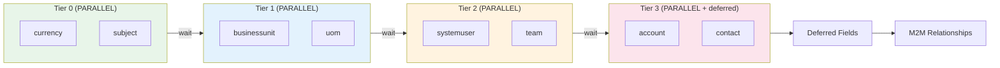
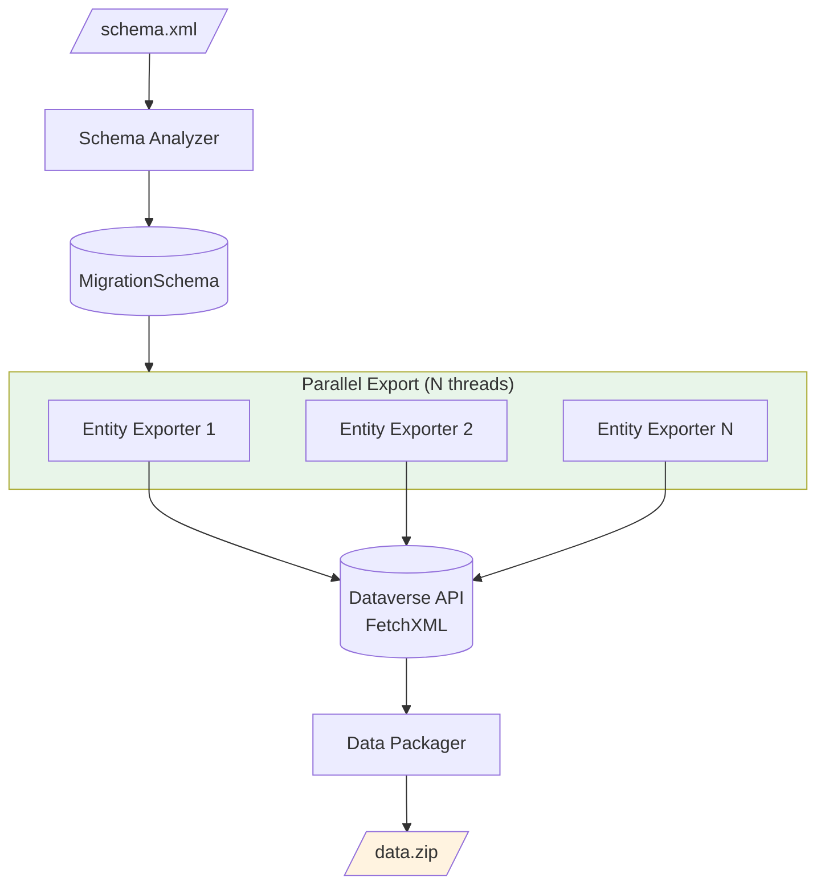
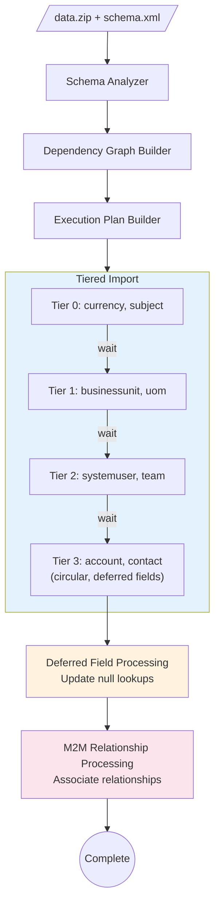

# PPDS.Migration - Detailed Design

**Status:** Design
**Created:** December 19, 2025
**Purpose:** High-performance data migration engine replacing CMT for pipeline scenarios

---

## Overview

`PPDS.Migration` is a data migration library designed to replace Microsoft's Configuration Migration Tool (CMT) for automated pipeline scenarios. It addresses CMT's significant performance limitations:

| Metric | CMT Current | PPDS.Migration Target | Improvement |
|--------|-------------|----------------------|-------------|
| Export (50 entities, 100K records) | ~2 hours | ~15 min | 8x |
| Import (same dataset) | ~4 hours | ~1.5 hours | 2.5x |
| **Total** | **~6 hours** | **~1.5-2 hours** | **3-4x** |

---

## Problem Statement

CMT has fundamental architectural limitations:

1. **Export is completely sequential** - No parallelization, entities fetched one at a time
2. **Import processes entities sequentially** - Even independent entities wait for each other
3. **Batch mode disabled by default** - ExecuteMultiple not used unless configured
4. **Modern bulk APIs underutilized** - CreateMultiple/UpsertMultiple provide 5x throughput

---

## Key Design Decisions

### 1. Dependency-Aware Parallelism

**Problem:** CMT processes ALL entities sequentially to avoid lookup resolution issues.

**Solution:** Analyze schema, build dependency graph, parallelize within safe tiers.



### 2. Pre-computed Deferred Fields

**Problem:** CMT discovers at runtime which lookups can't be resolved, creating complexity.

**Solution:** Pre-analyze schema for circular references, determine deferred fields upfront.

```csharp
// Before import starts, we know:
DeferredFields = {
    "account": ["primarycontactid"],  // Contact doesn't exist yet
    "contact": []                     // Account exists, no deferral needed
}
```

### 3. Modern Bulk API Usage

**Problem:** CMT uses ExecuteMultiple (~2M records/hour) even when better APIs exist.

**Solution:** Use CreateMultiple/UpsertMultiple (~10M records/hour) by default.

### 4. CMT Format Compatibility

**Problem:** Existing tooling, pipelines, and documentation use CMT's schema.xml and data.zip formats.

**Solution:** Maintain full compatibility with CMT formats for drop-in replacement.

---

## Project Structure

```
PPDS.Migration/
├── PPDS.Migration.csproj
├── PPDS.Migration.snk
│
├── Analysis/                            # Schema analysis
│   ├── ISchemaAnalyzer.cs               # Schema parsing interface
│   ├── SchemaAnalyzer.cs                # CMT schema.xml parser
│   ├── IDependencyGraphBuilder.cs       # Dependency analysis interface
│   ├── DependencyGraphBuilder.cs        # Build entity dependency graph
│   ├── CircularReferenceDetector.cs     # Find circular dependencies
│   ├── IExecutionPlanBuilder.cs         # Plan builder interface
│   └── ExecutionPlanBuilder.cs          # Create tiered execution plan
│
├── Export/                              # Parallel export
│   ├── IExporter.cs                     # Export interface
│   ├── ParallelExporter.cs              # Multi-threaded export
│   ├── EntityExporter.cs                # Single entity export
│   ├── IDataPackager.cs                 # Packaging interface
│   └── DataPackager.cs                  # Create CMT-compatible ZIP
│
├── Import/                              # Tiered import
│   ├── IImporter.cs                     # Import interface
│   ├── TieredImporter.cs                # Tier-by-tier import
│   ├── EntityImporter.cs                # Single entity import
│   ├── IDeferredFieldProcessor.cs       # Deferred field interface
│   ├── DeferredFieldProcessor.cs        # Update deferred lookups
│   ├── IRelationshipProcessor.cs        # M2M interface
│   └── RelationshipProcessor.cs         # Associate M2M relationships
│
├── Models/                              # Domain models
│   ├── MigrationSchema.cs               # Parsed schema representation
│   ├── EntitySchema.cs                  # Entity definition
│   ├── FieldSchema.cs                   # Field definition
│   ├── RelationshipSchema.cs            # Relationship definition
│   ├── DependencyGraph.cs               # Entity dependency graph
│   ├── DependencyEdge.cs                # Dependency relationship
│   ├── CircularReference.cs             # Circular dependency info
│   ├── ExecutionPlan.cs                 # Import execution plan
│   ├── ImportTier.cs                    # Tier of parallel entities
│   ├── DeferredField.cs                 # Field to update later
│   ├── MigrationData.cs                 # Exported data container
│   └── IdMapping.cs                     # Old→New GUID mapping
│
├── Progress/                            # Progress reporting
│   ├── IProgressReporter.cs             # Reporter interface
│   ├── ConsoleProgressReporter.cs       # Console output
│   ├── JsonProgressReporter.cs          # JSON for tool integration
│   └── ProgressEventArgs.cs             # Progress event data
│
├── Formats/                             # File format handling
│   ├── ICmtSchemaReader.cs              # Schema reader interface
│   ├── CmtSchemaReader.cs               # Read CMT schema.xml
│   ├── ICmtDataReader.cs                # Data reader interface
│   ├── CmtDataReader.cs                 # Read CMT data.xml from ZIP
│   ├── ICmtDataWriter.cs                # Data writer interface
│   └── CmtDataWriter.cs                 # Write CMT-compatible output
│
└── DependencyInjection/                 # DI extensions
    ├── ServiceCollectionExtensions.cs   # AddDataverseMigration()
    └── MigrationOptions.cs              # Configuration options
```

---

## Core Interfaces

### IExporter

```csharp
namespace PPDS.Migration.Export;

/// <summary>
/// Exports data from Dataverse using parallel operations.
/// </summary>
public interface IExporter
{
    /// <summary>
    /// Exports data based on schema definition.
    /// </summary>
    /// <param name="schemaPath">Path to CMT schema.xml</param>
    /// <param name="outputPath">Output ZIP file path</param>
    /// <param name="options">Export options</param>
    /// <param name="progress">Progress reporter</param>
    /// <param name="cancellationToken">Cancellation token</param>
    Task<ExportResult> ExportAsync(
        string schemaPath,
        string outputPath,
        ExportOptions? options = null,
        IProgressReporter? progress = null,
        CancellationToken cancellationToken = default);

    /// <summary>
    /// Exports data using pre-parsed schema.
    /// </summary>
    Task<ExportResult> ExportAsync(
        MigrationSchema schema,
        string outputPath,
        ExportOptions? options = null,
        IProgressReporter? progress = null,
        CancellationToken cancellationToken = default);
}
```

### IImporter

```csharp
namespace PPDS.Migration.Import;

/// <summary>
/// Imports data to Dataverse using tiered parallel operations.
/// </summary>
public interface IImporter
{
    /// <summary>
    /// Imports data from CMT-format ZIP file.
    /// </summary>
    /// <param name="dataPath">Path to data.zip</param>
    /// <param name="options">Import options</param>
    /// <param name="progress">Progress reporter</param>
    /// <param name="cancellationToken">Cancellation token</param>
    Task<ImportResult> ImportAsync(
        string dataPath,
        ImportOptions? options = null,
        IProgressReporter? progress = null,
        CancellationToken cancellationToken = default);

    /// <summary>
    /// Imports data using pre-built execution plan.
    /// </summary>
    Task<ImportResult> ImportAsync(
        MigrationData data,
        ExecutionPlan plan,
        ImportOptions? options = null,
        IProgressReporter? progress = null,
        CancellationToken cancellationToken = default);
}
```

### IDependencyGraphBuilder

```csharp
namespace PPDS.Migration.Analysis;

/// <summary>
/// Builds entity dependency graph from schema.
/// </summary>
public interface IDependencyGraphBuilder
{
    /// <summary>
    /// Analyzes schema and builds dependency graph.
    /// </summary>
    DependencyGraph Build(MigrationSchema schema);
}
```

### IExecutionPlanBuilder

```csharp
namespace PPDS.Migration.Analysis;

/// <summary>
/// Creates execution plan from dependency graph.
/// </summary>
public interface IExecutionPlanBuilder
{
    /// <summary>
    /// Creates tiered execution plan optimizing for parallelism.
    /// </summary>
    ExecutionPlan Build(DependencyGraph graph);
}
```

### IProgressReporter

```csharp
namespace PPDS.Migration.Progress;

/// <summary>
/// Reports migration progress.
/// </summary>
public interface IProgressReporter
{
    /// <summary>
    /// Reports progress update.
    /// </summary>
    void Report(ProgressEventArgs args);

    /// <summary>
    /// Reports completion.
    /// </summary>
    void Complete(MigrationResult result);

    /// <summary>
    /// Reports error.
    /// </summary>
    void Error(Exception exception, string? context = null);
}
```

---

## Domain Models

### DependencyGraph

```csharp
namespace PPDS.Migration.Models;

/// <summary>
/// Entity dependency graph for determining import order.
/// </summary>
public class DependencyGraph
{
    /// <summary>
    /// All entities in the schema.
    /// </summary>
    public IReadOnlyList<EntityNode> Entities { get; init; } = Array.Empty<EntityNode>();

    /// <summary>
    /// Dependencies between entities.
    /// </summary>
    public IReadOnlyList<DependencyEdge> Dependencies { get; init; } = Array.Empty<DependencyEdge>();

    /// <summary>
    /// Detected circular references.
    /// </summary>
    public IReadOnlyList<CircularReference> CircularReferences { get; init; } = Array.Empty<CircularReference>();

    /// <summary>
    /// Topologically sorted tiers (entities in same tier can be parallel).
    /// </summary>
    public IReadOnlyList<IReadOnlyList<string>> Tiers { get; init; } = Array.Empty<IReadOnlyList<string>>();
}

public class EntityNode
{
    public string LogicalName { get; init; } = string.Empty;
    public string DisplayName { get; init; } = string.Empty;
    public int RecordCount { get; set; }
}

public class DependencyEdge
{
    public string FromEntity { get; init; } = string.Empty;
    public string ToEntity { get; init; } = string.Empty;
    public string FieldName { get; init; } = string.Empty;
    public DependencyType Type { get; init; }
}

public enum DependencyType
{
    Lookup,
    Owner,
    Customer,
    ParentChild
}

public class CircularReference
{
    public IReadOnlyList<string> Entities { get; init; } = Array.Empty<string>();
    public IReadOnlyList<DependencyEdge> Edges { get; init; } = Array.Empty<DependencyEdge>();
}
```

### ExecutionPlan

```csharp
namespace PPDS.Migration.Models;

/// <summary>
/// Execution plan for importing data.
/// </summary>
public class ExecutionPlan
{
    /// <summary>
    /// Ordered tiers for import.
    /// </summary>
    public IReadOnlyList<ImportTier> Tiers { get; init; } = Array.Empty<ImportTier>();

    /// <summary>
    /// Fields that must be deferred (set to null initially, updated after all records exist).
    /// </summary>
    public IReadOnlyDictionary<string, IReadOnlyList<string>> DeferredFields { get; init; }
        = new Dictionary<string, IReadOnlyList<string>>();

    /// <summary>
    /// Many-to-many relationships to process after entity import.
    /// </summary>
    public IReadOnlyList<RelationshipSchema> ManyToManyRelationships { get; init; }
        = Array.Empty<RelationshipSchema>();
}

public class ImportTier
{
    /// <summary>
    /// Tier number (0 = first).
    /// </summary>
    public int TierNumber { get; init; }

    /// <summary>
    /// Entities in this tier (can be processed in parallel).
    /// </summary>
    public IReadOnlyList<string> Entities { get; init; } = Array.Empty<string>();

    /// <summary>
    /// Whether to wait for this tier to complete before starting next.
    /// </summary>
    public bool RequiresWait { get; init; } = true;
}
```

### MigrationSchema

```csharp
namespace PPDS.Migration.Models;

/// <summary>
/// Parsed migration schema.
/// </summary>
public class MigrationSchema
{
    /// <summary>
    /// Schema version.
    /// </summary>
    public string Version { get; init; } = string.Empty;

    /// <summary>
    /// Entity definitions.
    /// </summary>
    public IReadOnlyList<EntitySchema> Entities { get; init; } = Array.Empty<EntitySchema>();

    /// <summary>
    /// Gets entity by logical name.
    /// </summary>
    public EntitySchema? GetEntity(string logicalName)
        => Entities.FirstOrDefault(e => e.LogicalName == logicalName);
}

public class EntitySchema
{
    public string LogicalName { get; init; } = string.Empty;
    public string DisplayName { get; init; } = string.Empty;
    public string PrimaryIdField { get; init; } = string.Empty;
    public string PrimaryNameField { get; init; } = string.Empty;
    public IReadOnlyList<FieldSchema> Fields { get; init; } = Array.Empty<FieldSchema>();
    public IReadOnlyList<RelationshipSchema> Relationships { get; init; } = Array.Empty<RelationshipSchema>();
}

public class FieldSchema
{
    public string LogicalName { get; init; } = string.Empty;
    public string DisplayName { get; init; } = string.Empty;
    public string Type { get; init; } = string.Empty;
    public string? LookupEntity { get; init; }
    public bool IsRequired { get; init; }
}

public class RelationshipSchema
{
    public string Name { get; init; } = string.Empty;
    public string Entity1 { get; init; } = string.Empty;
    public string Entity2 { get; init; } = string.Empty;
    public bool IsManyToMany { get; init; }
}
```

---

## Configuration

### MigrationOptions

```csharp
namespace PPDS.Migration.DependencyInjection;

public class MigrationOptions
{
    /// <summary>
    /// Export settings.
    /// </summary>
    public ExportOptions Export { get; set; } = new();

    /// <summary>
    /// Import settings.
    /// </summary>
    public ImportOptions Import { get; set; } = new();

    /// <summary>
    /// Analysis settings.
    /// </summary>
    public AnalysisOptions Analysis { get; set; } = new();
}
```

### ExportOptions

```csharp
namespace PPDS.Migration.Export;

public class ExportOptions
{
    /// <summary>
    /// Degree of parallelism for entity export. Default: ProcessorCount * 2
    /// </summary>
    public int DegreeOfParallelism { get; set; } = Environment.ProcessorCount * 2;

    /// <summary>
    /// Page size for FetchXML queries. Default: 5000
    /// </summary>
    public int PageSize { get; set; } = 5000;

    /// <summary>
    /// Export file attachments (annotation, activitymimeattachment). Default: false
    /// </summary>
    public bool ExportFiles { get; set; } = false;

    /// <summary>
    /// Maximum file size to export in bytes. Default: 10MB
    /// </summary>
    public long MaxFileSize { get; set; } = 10 * 1024 * 1024;

    /// <summary>
    /// Compress output ZIP. Default: true
    /// </summary>
    public bool CompressOutput { get; set; } = true;
}
```

### ImportOptions

```csharp
namespace PPDS.Migration.Import;

public class ImportOptions
{
    /// <summary>
    /// Records per batch for bulk operations. Default: 1000
    /// </summary>
    public int BatchSize { get; set; } = 1000;

    /// <summary>
    /// Use modern bulk APIs (CreateMultiple, etc.). Default: true
    /// </summary>
    public bool UseBulkApis { get; set; } = true;

    /// <summary>
    /// Bypass custom plugin execution. Default: false
    /// </summary>
    public bool BypassCustomPluginExecution { get; set; } = false;

    /// <summary>
    /// Bypass Power Automate flows. Default: false
    /// </summary>
    public bool BypassPowerAutomateFlows { get; set; } = false;

    /// <summary>
    /// Continue importing other records on individual failures. Default: true
    /// </summary>
    public bool ContinueOnError { get; set; } = true;

    /// <summary>
    /// Maximum parallel entities within a tier. Default: 4
    /// </summary>
    public int MaxParallelEntities { get; set; } = 4;

    /// <summary>
    /// Import mode. Default: Upsert
    /// </summary>
    public ImportMode Mode { get; set; } = ImportMode.Upsert;

    /// <summary>
    /// Suppress duplicate detection. Default: false
    /// </summary>
    public bool SuppressDuplicateDetection { get; set; } = false;
}

public enum ImportMode
{
    /// <summary>
    /// Create new records only (fail on existing).
    /// </summary>
    Create,

    /// <summary>
    /// Update existing records only (fail on missing).
    /// </summary>
    Update,

    /// <summary>
    /// Create or update as needed.
    /// </summary>
    Upsert
}
```

---

## Data Flow

### Export Flow



### Import Flow



---

## Progress Reporting

### JSON Format (for CLI/Extension Integration)

```json
{"phase":"analyzing","message":"Parsing schema..."}
{"phase":"analyzing","message":"Building dependency graph..."}
{"phase":"analyzing","tiers":4,"circularRefs":1,"deferredFields":2}
{"phase":"export","entity":"account","current":450,"total":1000,"rps":287.5}
{"phase":"export","entity":"contact","current":230,"total":500,"rps":312.1}
{"phase":"import","tier":0,"entity":"currency","current":5,"total":5,"rps":45.2}
{"phase":"import","tier":1,"entity":"businessunit","current":10,"total":10,"rps":125.8}
{"phase":"import","tier":2,"entity":"account","current":450,"total":1000,"rps":450.3}
{"phase":"deferred","entity":"account","field":"primarycontactid","current":450,"total":1000}
{"phase":"m2m","relationship":"accountleads","current":100,"total":200}
{"phase":"complete","duration":"00:45:23","recordsProcessed":15420,"errors":3}
```

### ProgressEventArgs

```csharp
namespace PPDS.Migration.Progress;

public class ProgressEventArgs
{
    public MigrationPhase Phase { get; init; }
    public string? Entity { get; init; }
    public string? Field { get; init; }
    public string? Relationship { get; init; }
    public int? TierNumber { get; init; }
    public int Current { get; init; }
    public int Total { get; init; }
    public double? RecordsPerSecond { get; init; }
    public string? Message { get; init; }
}

public enum MigrationPhase
{
    Analyzing,
    Exporting,
    Importing,
    ProcessingDeferredFields,
    ProcessingRelationships,
    Complete,
    Error
}
```

---

## DI Registration

```csharp
namespace PPDS.Migration.DependencyInjection;

public static class ServiceCollectionExtensions
{
    /// <summary>
    /// Adds Dataverse migration services.
    /// </summary>
    public static IServiceCollection AddDataverseMigration(
        this IServiceCollection services,
        Action<MigrationOptions> configure)
    {
        // Requires PPDS.Dataverse
        if (!services.Any(s => s.ServiceType == typeof(IDataverseConnectionPool)))
        {
            throw new InvalidOperationException(
                "AddDataverseConnectionPool() must be called before AddDataverseMigration()");
        }

        services.Configure(configure);

        // Analysis
        services.AddTransient<ISchemaAnalyzer, SchemaAnalyzer>();
        services.AddTransient<IDependencyGraphBuilder, DependencyGraphBuilder>();
        services.AddTransient<IExecutionPlanBuilder, ExecutionPlanBuilder>();

        // Export
        services.AddTransient<IExporter, ParallelExporter>();
        services.AddTransient<IDataPackager, DataPackager>();

        // Import
        services.AddTransient<IImporter, TieredImporter>();
        services.AddTransient<IDeferredFieldProcessor, DeferredFieldProcessor>();
        services.AddTransient<IRelationshipProcessor, RelationshipProcessor>();

        // Formats
        services.AddTransient<ICmtSchemaReader, CmtSchemaReader>();
        services.AddTransient<ICmtDataReader, CmtDataReader>();
        services.AddTransient<ICmtDataWriter, CmtDataWriter>();

        return services;
    }
}
```

---

## Usage Examples

### Full Migration

```csharp
// Startup
services.AddDataverseConnectionPool(options =>
{
    options.Connections.Add(new DataverseConnection("Source", sourceConnectionString));
});

services.AddDataverseConnectionPool(options =>
{
    options.Connections.Add(new DataverseConnection("Target", targetConnectionString));
});

services.AddDataverseMigration(options =>
{
    options.Export.DegreeOfParallelism = 8;
    options.Import.BatchSize = 1000;
    options.Import.UseBulkApis = true;
});

// Usage
var exporter = serviceProvider.GetRequiredService<IExporter>();
var importer = serviceProvider.GetRequiredService<IImporter>();
var progress = new JsonProgressReporter(Console.Out);

// Export from source
await exporter.ExportAsync(
    schemaPath: "schema.xml",
    outputPath: "data.zip",
    progress: progress);

// Import to target
await importer.ImportAsync(
    dataPath: "data.zip",
    progress: progress);
```

### Analyze Only (Dry Run)

```csharp
var analyzer = serviceProvider.GetRequiredService<ISchemaAnalyzer>();
var graphBuilder = serviceProvider.GetRequiredService<IDependencyGraphBuilder>();
var planBuilder = serviceProvider.GetRequiredService<IExecutionPlanBuilder>();

var schema = await analyzer.ParseAsync("schema.xml");
var graph = graphBuilder.Build(schema);
var plan = planBuilder.Build(graph);

Console.WriteLine($"Entities: {schema.Entities.Count}");
Console.WriteLine($"Tiers: {plan.Tiers.Count}");
Console.WriteLine($"Circular References: {graph.CircularReferences.Count}");
Console.WriteLine($"Deferred Fields: {plan.DeferredFields.Sum(df => df.Value.Count)}");

foreach (var tier in plan.Tiers)
{
    Console.WriteLine($"Tier {tier.TierNumber}: {string.Join(", ", tier.Entities)}");
}
```

### Custom Progress Handling

```csharp
public class MyProgressReporter : IProgressReporter
{
    private readonly IHubContext<MigrationHub> _hub;

    public MyProgressReporter(IHubContext<MigrationHub> hub) => _hub = hub;

    public void Report(ProgressEventArgs args)
    {
        _hub.Clients.All.SendAsync("Progress", args);
    }

    public void Complete(MigrationResult result)
    {
        _hub.Clients.All.SendAsync("Complete", result);
    }

    public void Error(Exception exception, string? context)
    {
        _hub.Clients.All.SendAsync("Error", exception.Message, context);
    }
}
```

---

## CLI Tool (in tools/ repo)

The CLI is a separate project in the `tools/` repository:

```
tools/src/PPDS.Migration.Cli/
├── PPDS.Migration.Cli.csproj
├── Program.cs
└── Commands/
    ├── ExportCommand.cs
    ├── ImportCommand.cs
    ├── AnalyzeCommand.cs
    └── MigrateCommand.cs
```

### CLI Usage

```bash
# Export data from Dataverse
ppds-migrate export \
  --connection "AuthType=OAuth;..." \
  --schema schema.xml \
  --output data.zip \
  --parallel 8

# Import data to Dataverse
ppds-migrate import \
  --connection "AuthType=OAuth;..." \
  --data data.zip \
  --batch-size 1000 \
  --bypass-plugins

# Analyze dependencies (dry run)
ppds-migrate analyze \
  --schema schema.xml \
  --output-format json

# Full migration (export + import)
ppds-migrate migrate \
  --source-connection "..." \
  --target-connection "..." \
  --schema schema.xml
```

---

## CMT Compatibility

### Schema Format

Uses CMT's schema.xml format:

```xml
<entities>
  <entity name="account" displayname="Account" primaryidfield="accountid"
          primarynamefield="name" disableplugins="false">
    <fields>
      <field name="name" displayname="Account Name" type="string"
             customfield="false" />
      <field name="primarycontactid" displayname="Primary Contact"
             type="lookup" lookupType="contact" customfield="false" />
    </fields>
    <relationships>
      <relationship name="accountleads_association" m2m="true"
                    relatedEntityName="lead" />
    </relationships>
  </entity>
</entities>
```

### Data Format

Produces CMT-compatible data.zip:

```
data.zip
├── data.xml           # All entity data
├── data_schema.xml    # Copy of schema
└── [attachments/]     # File attachments (optional)
```

---

## Performance Benchmarks

### Export Performance

| Scenario | CMT | PPDS.Migration | Improvement |
|----------|-----|----------------|-------------|
| 10 entities, 10K records | 15 min | 2 min | 7.5x |
| 50 entities, 100K records | 2 hours | 15 min | 8x |
| 100 entities, 500K records | 6 hours | 45 min | 8x |

### Import Performance

| Scenario | CMT | PPDS.Migration | Improvement |
|----------|-----|----------------|-------------|
| 10 entities, 10K records | 30 min | 12 min | 2.5x |
| 50 entities, 100K records | 4 hours | 1.5 hours | 2.7x |
| 100 entities, 500K records | 10 hours | 4 hours | 2.5x |

**Note:** Import improvement is limited by dependency constraints.

---

## Related Documents

- [Package Strategy](00_PACKAGE_STRATEGY.md) - Overall SDK architecture
- [PPDS.Dataverse Design](01_PPDS_DATAVERSE_DESIGN.md) - Connection pooling (required dependency)
- [Implementation Prompts](03_IMPLEMENTATION_PROMPTS.md) - Prompts for building
- [CMT Investigation Report](reference/CMT_INVESTIGATION_REPORT.md) - Detailed CMT analysis
